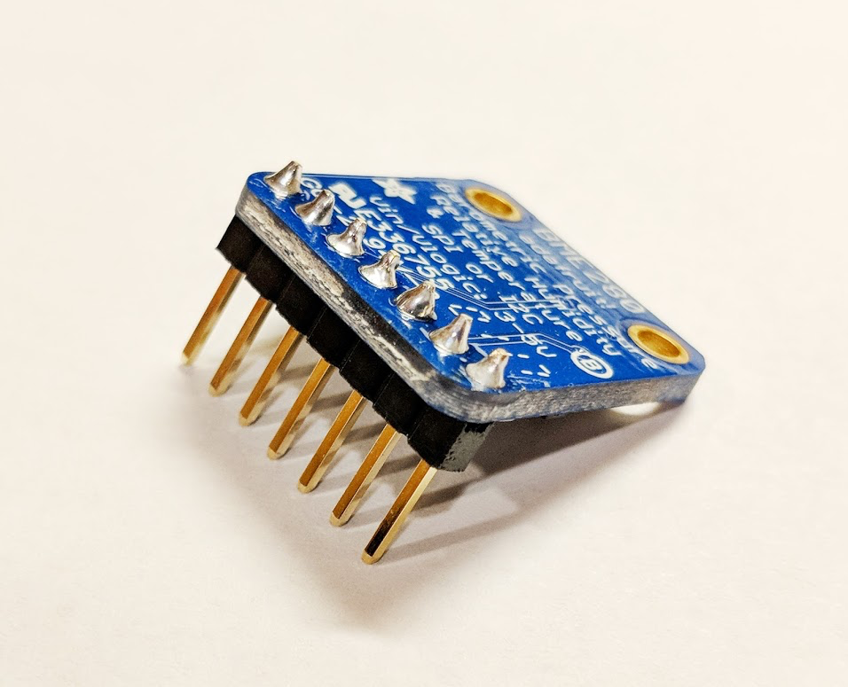
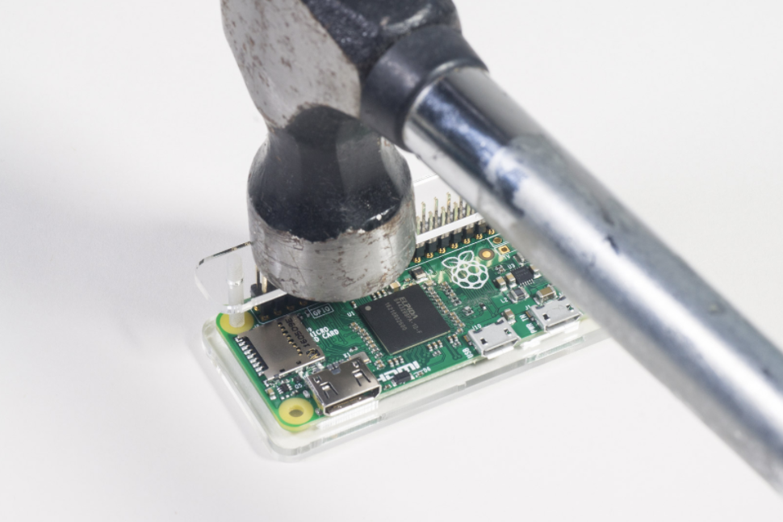
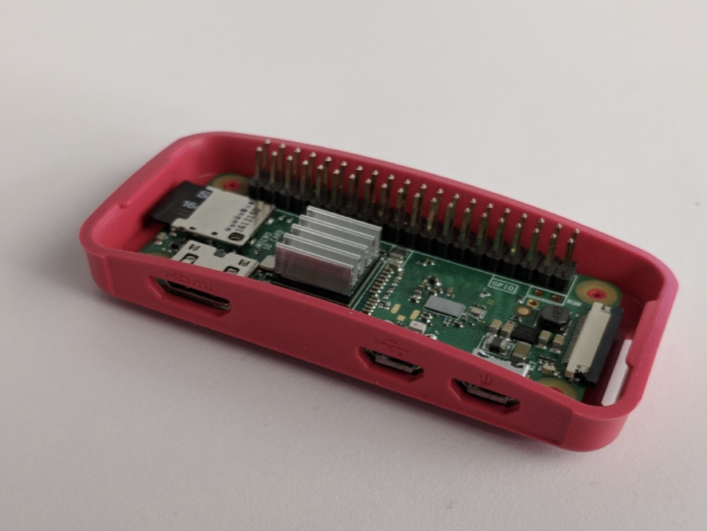
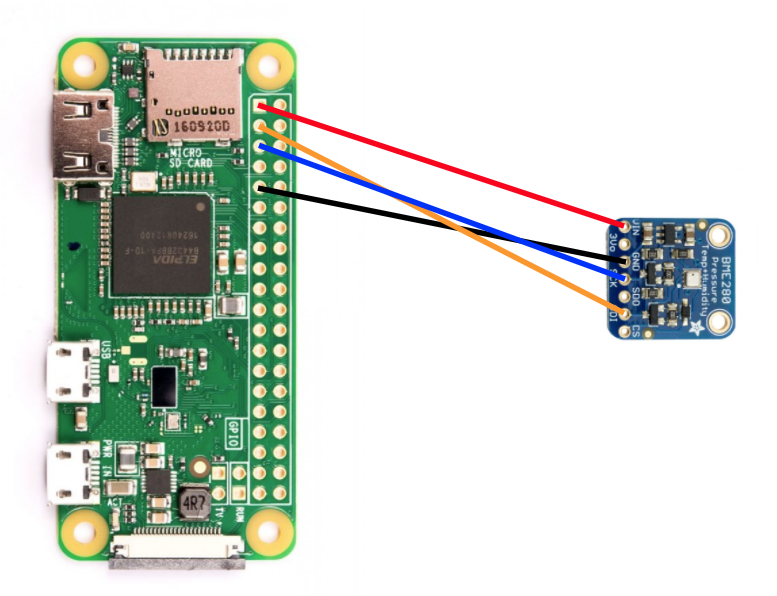
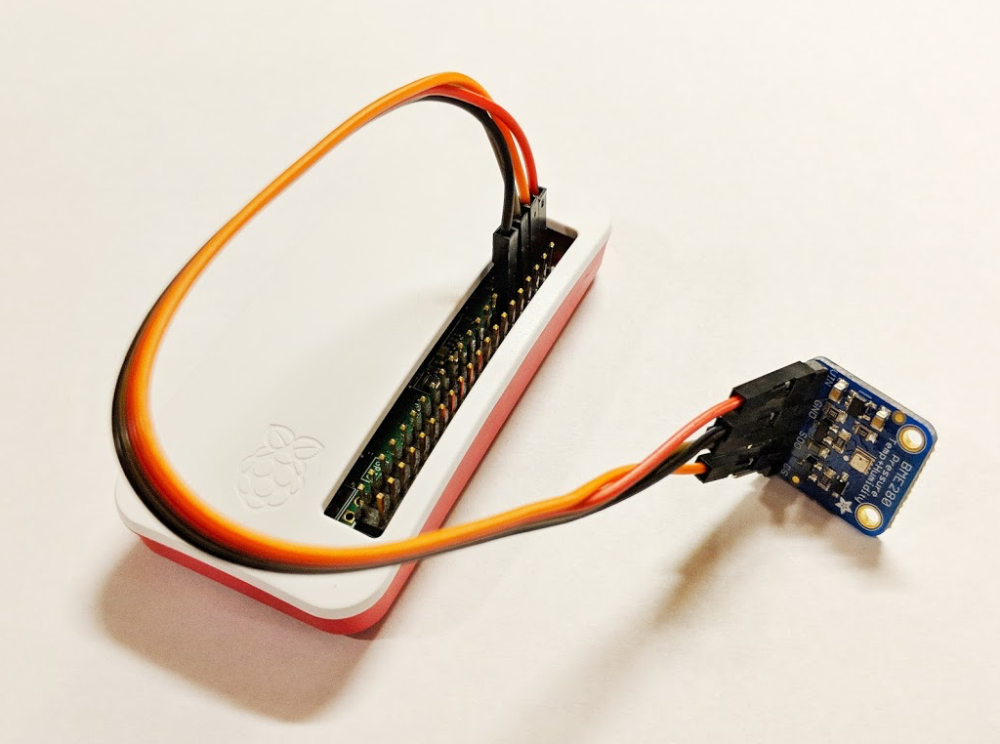
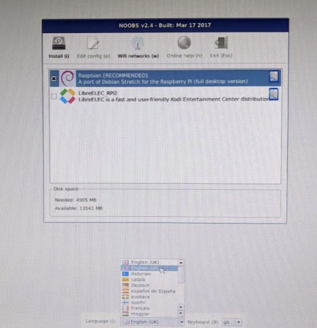
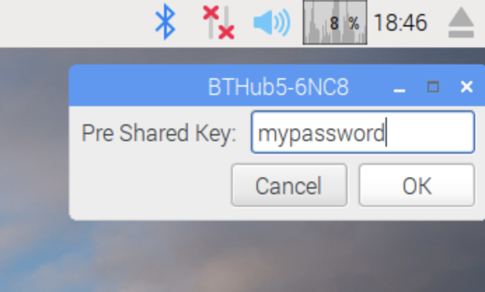
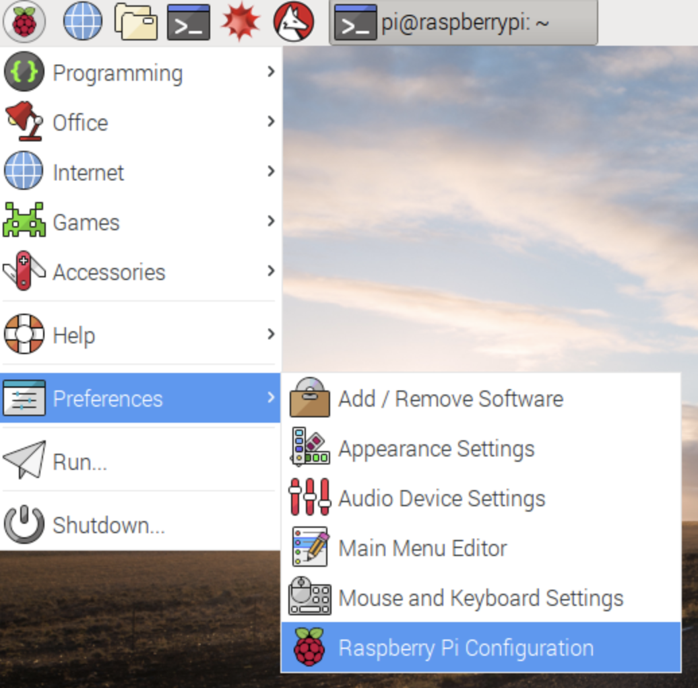
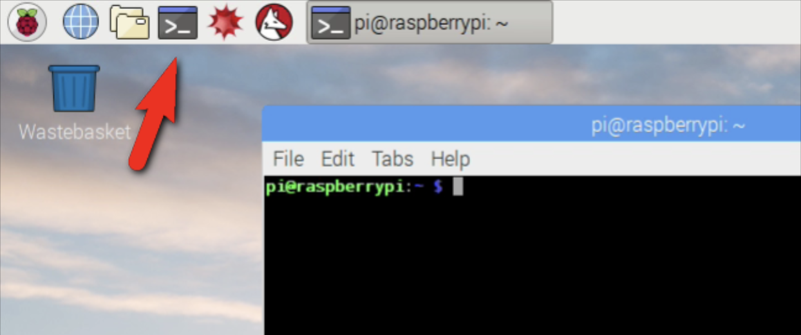
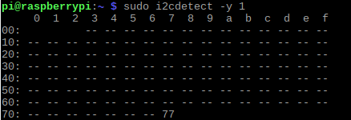

# iot-data-pipeline

You will build an IoT device (Raspberry Pi) that measures weather data and is ready to interact with the Google Cloud Platform. In conjunction with the steps included in a [Google Codelab](https://codelabs.developers.google.com/) ("Building a Serverless Data Pipeline: IoT to Analytics"), the weather data can be published to a data pipeline that includes a message queue, a serverless function, a Cloud-based data warehouse and an analytics dashboard using Google’s Cloud Platform.

## Getting Started

### Prerequisites

[These items can be ordered as a complete kit or as individual parts here](https://www.arrow.com/en/research-and-events/articles/codelabs-builiding-a-serverless-data-pipeline)

* Raspberry Pi Zero W with power supply, SD memory card and case

* USB card reader

* USB hub (to allow for connecting a keyboard and mouse into the sole USB port on the Raspberry Pi)

* Female-to-female breadboard wires

* GPIO Hammer Headers

* BME280 sensor

* Soldering iron

* Solder

* Computer monitor or TV with HDMI input, HDMI cable, keyboard and a mouse

The Raspberry Pi Zero W is recommended for this codelab, but a Raspberry Pi 3 Model B will also work, won’t require hammer header pins or a USB hub, has a better CPU, but will cost more. If you choose to move forward with the alternate device, make certain that you have a power supply and an appropriate SD card.

### Assemble the Raspberry Pi and sensor

Solder the header pins to the sensor board. 



Carefully install the hammer header pins into the Raspberry Pi.



Format the SD card and install the NOOBS (New Out Of Box Software) installer by following the [steps] here(https://www.raspberrypi.org/documentation/installation/noobs.md). Insert the SD card into the Raspberry Pi and place the Raspberry Pi into its case.



Use the breadboard wires to connect the sensor to the Raspberry Pi according to the diagram below.



Raspberry Pi pin -> Sensor connection
Pin 1 (3.3V) -> VIN
Pin 3 (CPIO2) -> SDA
Pin 5 (GPIO3) -> SCL
Pin 9 (Ground) -> GND



Connect the monitor (using the mini-HDMI connector), keyboard/mouse (with the USB hub) and finally, power adapter. 

### Configure the Raspberry Pi and sensor

After the Raspberry Pi finishes booting up, select Raspbian for the desired operating system, make certain your desired language is correct and then click on Install (hard drive icon on the upper left portion of the window).



Click on the Wifi icon (top right of the screen) and select a network. If it is a secured network, enter the password (pre shared key).



Click on the raspberry icon (top left of the screen), select Preferences and then Raspberry Pi Configuration. From the Interfaces tab, enable SSH and I2C. From the Localisation tab, set the Locale and the Timezone. After setting the Timezone, allow the Raspberry Pi to reboot.



After the reboot has completed, click on the Terminal icon to open a terminal window. 



Type in the following command to make certain that the sensor is correctly connected.

```
  sudo i2cdetect -y 1
```

The result should look like this -- make sure it reads 77.



An all 0 result indicates that the sensor isn’t being read by the Raspberry Pi -- check the wiring and connections. 

A result other than 77 could indicate that the type of sensor doesn’t match the one recommended by this codelab and this will cause the sensor driver to not function correctly. To fix this situation, you’ll need to edit the Adafruit_BME280.py script that is downloaded in the “Install the sensor software and weather script” section below. For example, if the result is showing 76, you will need to change the BME280_I2CADDR to 0x76.

### Install the Google Cloud SDK

In order to leverage the tools on the Google Cloud platform, the Google Cloud SDK will need to be installed on the Raspberry Pi. The SDK includes the tools needed to manage and leverage the Google Cloud Platform and is available for several programming languages.

Open a terminal window on the Raspberry Pi if one isn’t already open and set an environment variable that will match the SDK version to the operating system on the Raspberry Pi.

```
  export CLOUD_SDK_REPO=”cloud-sdk-$(lsb_release -c -s)”
```

Now add the location of where the Google Cloud SDK packages are stored so that the installation tools will know where to look when asked to install the SDK.

```
  echo “deb http://packages.cloud.google.com/apt $CLOUD_SDK_REPO main” |  sudo tee -a /etc/apt/sources.list.d/google-cloud-sdk.list
```

Add the public key from Google’s package repository so that the Raspberry Pi will verify the security and trust the content during installation

```
  curl https://packages.cloud.google.com/apt/doc/apt-key.gpg | sudo apt-key add -
```

Make sure that all the software on the Raspberry Pi is up to date and install the core Google Cloud SDK

```
  sudo apt-get update && sudo apt-get install google-cloud-sdk
```
NOTE: The installation speed of the SDK is dependent both on the network speed and the Raspberry Pi processor. The Raspberry Pi Zero W can take around 30 minutes to complete the install. If you are using the alternate hardware (Raspberry Pi 3 Model B), install times are typically much faster.

Install the tendo package using the Python package manager (this package is used to prevent check if a script is running more than once and will be used to check on the weather script that is implemented later).

```
  pip install tendo
```


Make sure the Google Cloud packages for Python are up to date using the Python package manager

```
  sudo pip install --upgrade google-cloud-pubsub
  sudo pip install --upgrade oauth2client
```

The installation speed of the SDK is dependent both on the network speed and the Raspberry Pi processor. The Raspberry Pi Zero W can take around 30 minutes to complete the install. If you are using the alternate hardware (Raspberry Pi 3 Model B), install times are typically much faster.


### Install the sensor software and weather script


From the command line on the Raspberry Pi, clone the needed packages for reading information from the input/output pins.

```
  git clone https://github.com/adafruit/Adafruit_Python_GPIO
```

Install the downloaded packages

```
  cd Adafruit_Python_GPIO

  sudo python setup.py install

  cd ..
```

Clone the project code that enables the weather sensor

```
  git clone https://github.com/googlecodelabs/iot-data-pipeline
```

Copy the sensor driver into the same directory as the remainder of the downloaded software.

```
cd iot-data-pipeline/third_party/Adafruit_BME280/
mv Adafruit_BME280.py ../..
cd ../..
```

To connect the sensor to the Google Cloud Platform, follow the instructions in the [Google Codelab](https://codelabs.developers.google.com/) ("Building a Serverless Data Pipeline: IoT to Analytics").

## Contributing

Please read [CONTRIBUTING.md](CONTRIBUTING.md) for details on our code of conduct, and the process for submitting pull requests to us.

## License

This project is licensed under the Apache 2.0 License - see the [LICENSE.md](LICENSE.md) file for details
